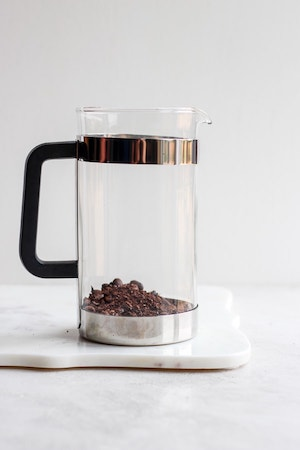
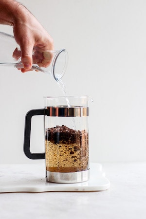
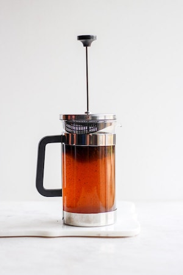
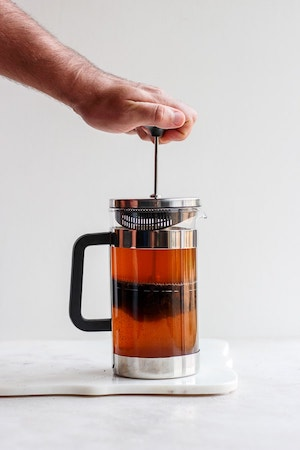
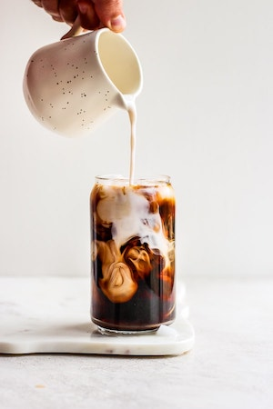
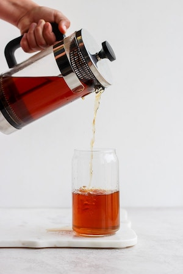

# How To Make Your Own Cold Brew Coffee

Cold brew coffee is a lot less acidic than standard coffee. It's a popular drink in coffee shops and can easily be made at home. Spending five minutes the night before you want your cold brew can save you time in the morning and your hard-earned money.

## Required Supplies
* French press
* 1 cup of coarsely ground coffee  

    > Coarsely ground coffee keeps the grounds from clogging or passing through the filter of the french press.

* 4 cups of tap water

    > Use a 1:4 ratio of coffee to water. So, for this example we're use 1 cup of coffee for 4 cups of water. If your french press cannot hold this amount, decrease the amount of water and coffee while keeping the same ratio.
* Mason jar to save potential leftovers

## Steps
1. Add 1 part coarsely ground coffee into the french press.  

2. Add 4 parts of water into the french press after the coffee.  

3. Stir gently with a spoon and make sure all coffee grounds are covered by water. 
4. Place the filter on top and allow the coffee to steep overnight for 12-24 hours.  

    > The longer you let it steep, the stronger it will be.

5. After allowing the coffee to steep, push the filter down to strain the grounds out.  

6. You now have cold brew concentrate. To serve, add 1 part water with 1 part of the concentrate.

    > For example, if you're using a 2 cup mug, add 1 cup of cold water with 1 cup of concentrate. If you're going to add ice, you can add the concentrate first and then split remaining space for ice and water, since the ice dilutes the concentrate also.
    
7. If desired, add in cream/milk and sugar, and then enjoy!  

8. If you have leftover concentrate, save it in a mason jar. It can stay in the fridge for up to a week.  
